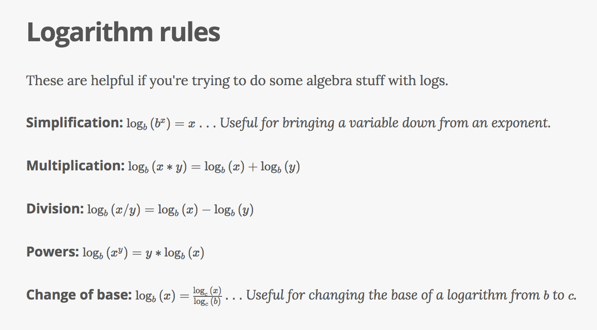
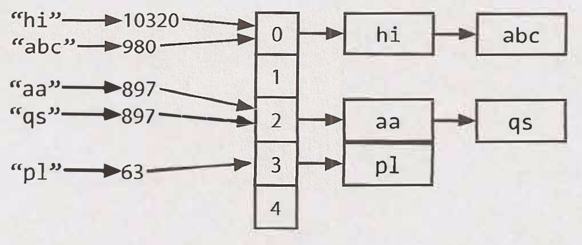

### Java Notes

* Objects are a runtime concept, they do not actually exist until the program is actually running
* In Java, methods are what do all the work

### General Notes
* Binary search trees require a `sorted` collection of data to work

### Common Phrases

* "How many times must we double 1 before we get to n?" `log_2(n)`

### Useful Charts

